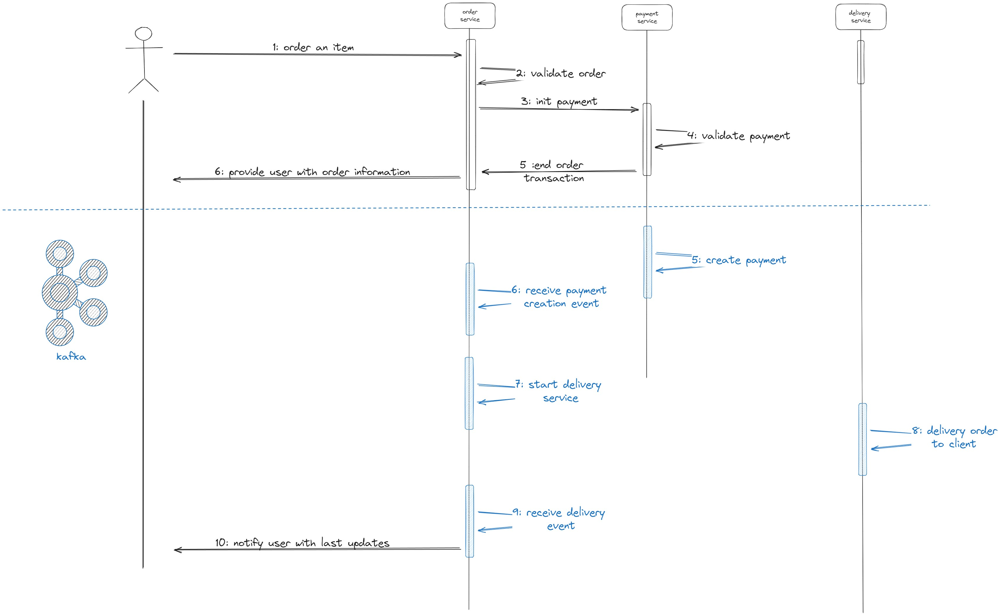

# Neoxia Kafka Demo Microservice

This Spring Boot project serves as a demonstration of how to work with Kafka messaging in a Java 17 environment, using Spring Boot version 3.2.4.

## Introduction

The Neoxia Kafka Demo Microservice provides a simple example of integrating Kafka messaging within a Spring Boot application. This README provides an overview of the project structure, setup instructions, and how to run the demo.

## Setup Instructions

To run the Neoxia Kafka Demo Microservice, follow these steps:

1. **Clone the repository:** https://github.com/avx99/neoxia-kafka-demo-microservice
2. **Navigate to the project directory**
3. **Navigate to docker-compose folder**
4. **Execute :**
```
 init.bat <OR> ./init.sh for linux 
 docker-compose -f postgres.yml up 
 docker-compose -f common.yml -f zookeeper.yml up
 docker-compose -f common.yml -f kafka_cluster.yml up 
 docker-compose -f common.yml -f init_kafka.yml up    
```
5. **Build the project:**
```
java -jar target/neoxia-kafka-demo-microservice.
```


## Use Case description
 
it's a simple simulation of performing an online order from an e-com website in which  the user consume an order creation api, and can see its status via another api.
here is the use case diagram : 


### create order api : ``POST {{base_url}}/orders``
#### payload example :
````
{
    "customerId" : "d215b5f8-0249-4dc5-89a3-51fd148cfb41",
    "price": 2115,
    "address": {
        "street": "r1",
        "postalCode": "443",
        "city": "casa"
    },
    "items": [
        {
            "productId": "d215b5f8-0249-4dc5-89a3-51fd148cfb48",
            "quantity": 1,
            "price": 2115,
            "subTotal": 2115
        }
    ]
}
````
### get details order api : ``POST {{base_url}}/orders?customer_id``
#### query example
```
{{base_url}}/orders?customer_id=d215b5f8-0249-4dc5-89a3-51fd148cfb41
```
